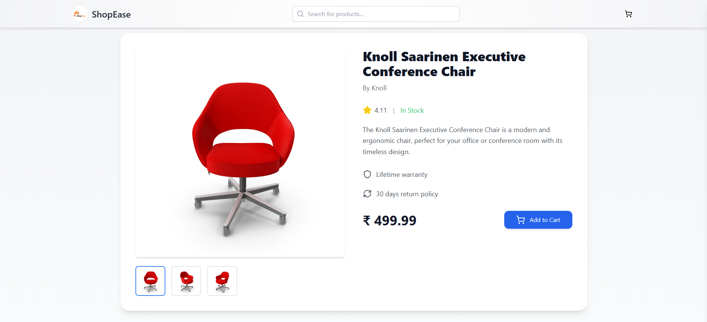

Here’s an enhanced and more polished version of your markdown:

# Installation Guide

Before getting started, ensure you have **Node.js** and **npm** installed on your machine.

---

## Steps to Get Started

### 1. Clone the Repository

```bash
git clone https://github.com/yashwanth2000/react-product-catalog.git
```

### 2. Navigate to the Project Directory

```bash
cd react-product-catalog
```

### 3. Install Dependencies

Install all necessary dependencies for both the client and server:

```bash
npm install
```

### 4. Run the Application

Start both the client and server simultaneously:

```bash
npm run dev
```

---

## Libraries Used

- **Styling:** [Tailwind CSS](https://tailwindcss.com)
- **Routing:** [React Router DOM](https://reactrouter.com)
- **Icons:** [Lucide-react](https://lucide.dev)
- **Type Checking:** [PropTypes](https://www.npmjs.com/package/prop-types)
- **Toast Notifications:** [React Hot Toast](https://react-hot-toast.com)
- **Skeleton Loader:** [React Skeleton Loader](https://www.npmjs.com/package/react-loading-skeleton)

## Challenges Faced

During the development of the e-commerce application, a significant challenge arose with implementing the search functionality. While the search filter logic was correctly filtering the data (as evidenced by console logs showing proper filtering of products), the results weren't being displayed in the user interface. The main issue was in the state management and component rendering cycle - although the data was being filtered correctly, the UI wasn't updating to reflect these changes. The solution involved restructuring the state management in the useProducts hook by separating the original products state from the filtered products state, and ensuring proper propagation of state updates to trigger re-renders of the components. This experience highlighted the importance of proper state management in React applications and the need for clear data flow patterns. Although the implementation seemed straightforward initially, debugging and fixing this issue required a systematic approach to identify where the state updates weren't properly triggering UI changes.

## Screen Shot

### Product Catalog


### Product Detail


### Cart Drawer


